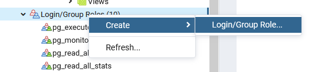
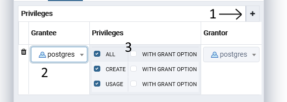
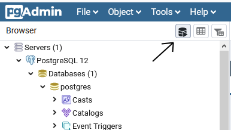

[English](#English) below ⬇️ 
# Français

## Installation de PosgreSQL
Télécharger la dernière version de PosgreSQL(12.3) à l'url suivante : 
	[https://www.enterprisedb.com/downloads/postgres-postgresql-downloads](https://www.enterprisedb.com/downloads/postgres-postgresql-downloads)
	
Une fois l'installation finie, exécuter le programme pgAdmin (cela ouvrira une page internet pour accéder à l'interface administrateur de posgresql)
	
Se connection en utilisant le mot de passe renseigné durant l'installation (Le "Master password" et le mot de passe pour accéder à la base de donnée PostgreSQL 12 sont les mêmes)

## Réglages de la base de donnée
### Création d'un nouvel utilisateur wakfu_builder

Click droit sur 'Login/Group Roles' > Create > Login/Group Role...

* Dans **General**: nommez le _wakfu_builder_
* Dans **Privileges**: reglez'_Can login?_', '_Inherits rigths from the parent roles_' et '_can initiate streaming replication and backup_' à '**Yes**'
* Dans **Membership**: Ajouter 'postgres' dans la liste des rôles

Sauvegarder
			
### Ajouter un nouveau schéma et l'appeler wakfu_builder
* Dans **General**: 
  * appelez le _wakfu_builder_
  * sélectionner '_postgres_' dans le champ 'propriétaire' (Owner en anglais, choix par défaut)
* Dans **Security**: Ajouter '_postgres_' et '_wakfu_builder_' en tant bénéficiaire (Grantee) avec tous les privilèges.

Sauvegarder

### Régler le mot de passe de l'utilisateur wakfu_builder

Cliquez sur le bouton _outils de requêtes_ (Query Tool) en haut à gauche

	
Dans l'éditeur de requête, copiez et collez la ligne de commande suivante :

⚠️ Remplacez _'your_password'_ par ce que vous voulez, cependant ce mot de passe sera nécessaire pour permettre au programme de se connecter à la base de donnée lors de la première exécution ⚠️ 

	 ALTER USER wakfu_builder password 'your_password';

Appuyez sur la touche **_F5_** pour exécuter la commande

Le programme devrait être utilisable entièrement une fois installé à son tour. Il faudra cependant remplir avec les données fournies par Ankama, pour cela il faudra passer par le menu _Gestion_ > _check new version_, puis 'Update files', 'Update Database' et finalement 'Update images', cela peut prendre un certain temps suivant la qualité de votre connexion et du PC

Le programme est maintenant prêt à être utilisé ! 🎉

### Faire un reset de la base de donnée

Si il est nécessaire de faire un reset de la base de donnée pour quelque raison que ce soit, se connecter directement à l'outil de requête de pgAdmin comme présenté [précédemment](#r%C3%A9gler-le-mot-de-passe-de-lutilisateur-wakfu_builder) ou passer par le petit programme _psql_ qui a été installé avec (valider tout jusqu'à ce que le mot de passe soit demandé) Et exécuter les commandes suivantes :
If ever needed, for reseting the database datas, run the following commands in Sql Shell (psql):

	delete from wakfu_builder.action;
	delete from wakfu_builder.itemproperties;
	delete from wakfu_builder.equipmentItemType;
	delete from wakfu_builder.equipmentPosition;
	delete from wakfu_builder.eqpType_Pos_relation;
	delete from wakfu_builder.eqpType_DisPos_relation;
  delete from wakfu_builder.relation_item_carac;
	delete from wakfu_builder.states;

	delete from wakfu_builder.effect;
	delete from wakfu_builder.item;
	delete from wakfu_builder.item_properties_relation;
	delete from wakfu_builder.item_useEffect_relation;
	delete from wakfu_builder.item_useCriticalEffect_relation;
	delete from wakfu_builder.item_useEquipEffect_relation;
	delete from wakfu_builder.carac;
        delete from wakfu_builder.enchant_effect;

# English
## Install PosgreSQL
Download from the lastest version of PosgreSQL(12.3) at: 
	[https://www.enterprisedb.com/downloads/postgres-postgresql-downloads](https://www.enterprisedb.com/downloads/postgres-postgresql-downloads)
	
Run pgAdmin (will open a web browser to access posgresql admin interface)
	
Log on with the master password chosen during installation 
(The Master password and the password to access the PostgreSQL 12 Server are the same)

## Database setup
### Create a new user wakfu_builder

Right click on 'Login/Group Roles' > Create > Login/Group Role...

* In **General**: name it _wakfu_builder_
* In **Privileges**: set '_Can login?_', '_Inherits rigths from the parent roles_' and '_can initiate streaming replication and backup_' to '**Yes**'
* In **Membership**: add 'postgres' in the Roles list

Then Save
			
### Add a new Schemas and name it wakfu_builder
* In **General**: 
  * Name it _wakfu_builder_
  * Set the Owner to '_postgres_' (default choice)
* In **Security**: add '_postgres_' and '_wakfu_builder_' as Grantee with all the privileges

Then save

### Setting wakfu_builder user password

Click on the _Query Tool_ button on top of the browser

	
In the query editor copy and paste the following command: 

⚠️ change _'your_password'_ with what ever you want, but it will be necessary for the software to connect to the database, and will be asked on the first run ⚠️ 

	 ALTER USER wakfu_builder password 'your_password';

Press **_F5_** to execute the command

The application should now be runable, the only thing left is to fill up the database using the tool in the application.
Go to Gestion, and then click on 'check new version' and then update the files, the database and finaly the images.

The application is now READY ! 🎉 

### Reseting the database tables

If ever needed, for reseting the database datas, run the following commands in Sql Shell (psql):

	delete from wakfu_builder.action;
	delete from wakfu_builder.itemproperties;
	delete from wakfu_builder.equipmentItemType;
	delete from wakfu_builder.equipmentPosition;
	delete from wakfu_builder.eqpType_Pos_relation;
	delete from wakfu_builder.eqpType_DisPos_relation;
	delete from wakfu_builder.relation_item_carac;
	delete from wakfu_builder.states;

	delete from wakfu_builder.effect;
	delete from wakfu_builder.item;
	delete from wakfu_builder.item_properties_relation;
	delete from wakfu_builder.item_useEffect_relation;
	delete from wakfu_builder.item_useCriticalEffect_relation;
	delete from wakfu_builder.item_useEquipEffect_relation;
	delete from wakfu_builder.carac;
	
# To compile your own version
## For QtCreator
### Windows

Add to the compilation PATH : 
* For OpenSSL :
	PATH_TO_QT_DIR\Tools\OpenSSL\Win_x64\bin;
* For POSGRESQL :
	PATH_TO_POSTGRESQL_DIR\bin;
	PATH_TO_POSTGRESQL_DIR\lib;
* For Windows kits :
	C:\Program Files (x86)\Windows Kits\10\bin\10.0.17134.0\x64
